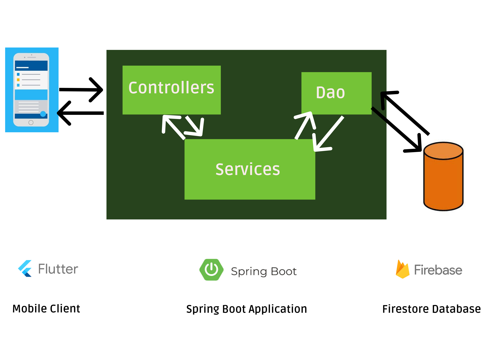
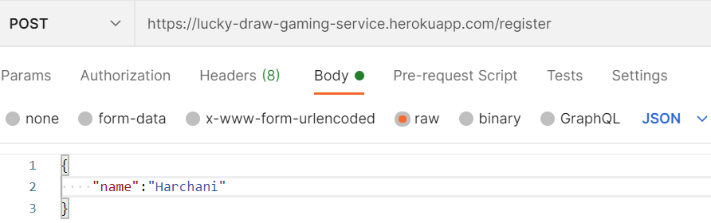
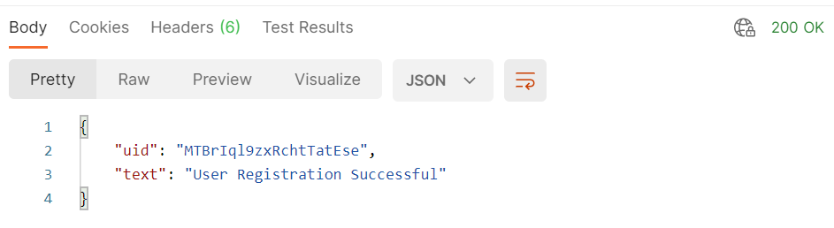
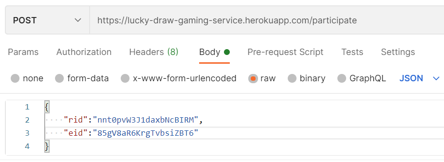
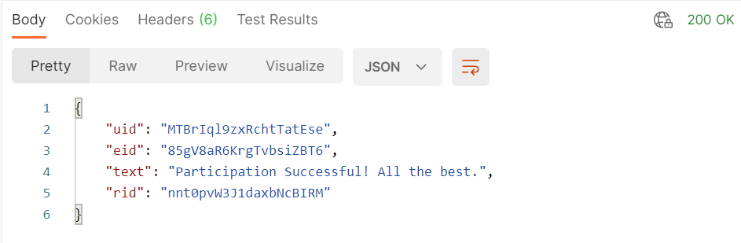
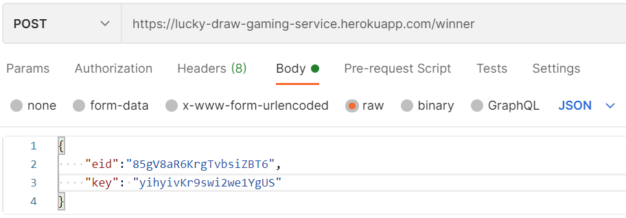
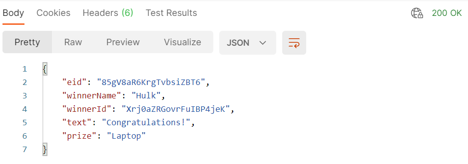
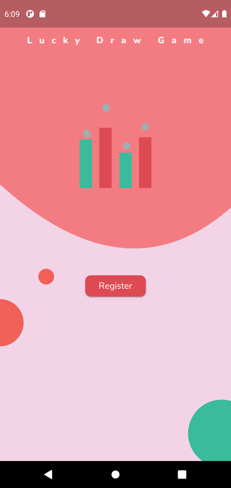
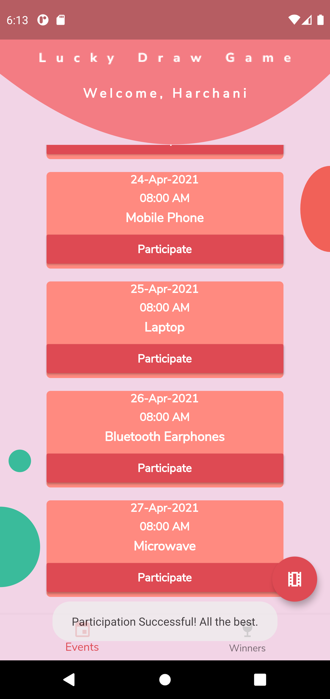
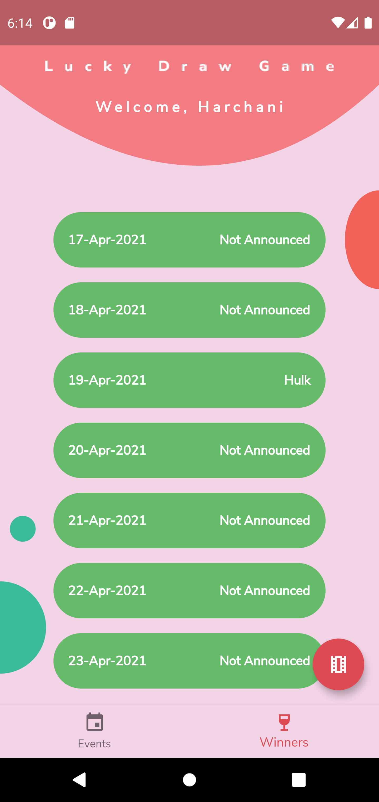

# Lucky Draw Gaming Service

## API ENDPOINT
**Base URL:** https://lucky-draw-gaming-service.herokuapp.com/

The backend API service which is built using Spring Boot in Java provides the following method calls:

| Method  | API URL | Operation |
| ------------- | ------------- | ------------ |
| POST   | /register | Registers user and returns User ID | 
| GET    | /raffle-ticket/{userId}     | Generates a raffle-ticket for a user for participation in a lucky draw event |
| POST | /participate | Allows user with raffle-ticket to participate in an event |
| GET | /winners | Gets winners of all events in the last one week |
| POST | /winner | Computes Winners for an event [Access only to admin through ADMIN_KEYS] |
| GET | /events | Gets event details for past and upcoming week |

## Sample Requests
Some common abreviations used:

- uid: User ID

*Can be generated after user registration*

- rid: Raffle-Ticket ID

*Can be generated using GET method on raffle-ticket*

- eid: Event ID 

*Can be checked using GET method on events*

Register User             |  Response
:-------------------------:|:-------------------------:
  |  

Participate In Lucky Draw Event            |  Response
:-------------------------:|:-------------------------:
  |  

Compute Winner [ADMIN-ONLY]           |  Response
:-------------------------:|:-------------------------:
  |  

## Mobile App Screenshots

Registration Page            |  Events Page | Winners Page
:-------------------------:|:-------------------------:|:-----------------:|
  |   |  

### Technologies, Frameworks and Languages Used
- Firebase
- Spring Boot
- Java
- Flutter
- Dart
- Heroku

The following project has tried to follow the best practices for REST API Design according to this stack-overflow [post](https://stackoverflow.blog/2020/03/02/best-practices-for-rest-api-design/).

